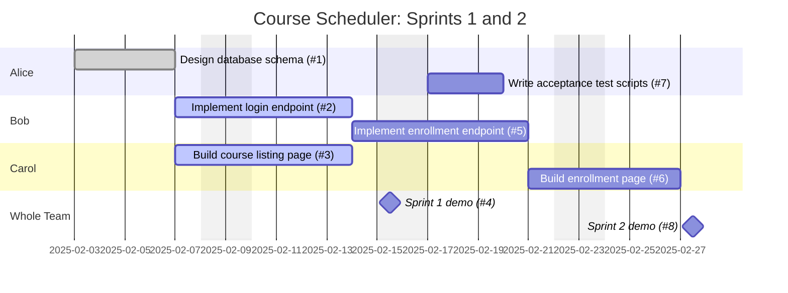

## From Kanban Board to Gantt Chart with GitHub Projects

Real software teams rarely draw their Gantt charts by hand.  Instead, they track their work as **issues** on a kanban board (in GitHub Projects, Trello, Asana, or Jira), and generate a timeline view from that board.  In this walkthrough, you will practice this the way a real team does it on GitHub: create issues, organize them on a Projects kanban board, and then render the same plan as a Gantt chart using **Mermaid**, a text-based diagramming language that GitHub renders automatically inside any Markdown file, issue, or README.

### Step 1: Capture Your Tasks as GitHub Issues

Every row of your Gantt chart should begin its life as a GitHub issue.  For each task on your project plan:

1. In your project repository, click **Issues**, then **New issue**.
2. Give the issue a short, action-oriented title (for example, "Implement login endpoint").
3. In the description, note the estimated duration (using your optimistic/normal/pessimistic estimates from the model above) and any issues it depends on (for example, "Blocked by #3").
4. **Assign an owner**: in the right sidebar, use the **Assignees** field to name exactly one teammate responsible for the task.  Tasks without an owner tend not to get done; tasks with two owners tend to get done twice (differently!).

### Step 2: Organize the Issues on a Kanban Board

From your repository or organization, click **Projects**, then **New project**, and choose the **Board** template.  You will see the classic kanban columns: **Todo**, **In Progress**, and **Done**.  Add each of your issues to the board.  GitHub Projects also provides built-in **Roadmap** view: if you add custom **Start date** and **Target date** fields to your project items, the Roadmap view will draw a timeline for you automatically -- this is a kanban-to-Gantt conversion built right into GitHub, and you are welcome to use it for your project.

### Step 3: Render the Plan as a Mermaid Gantt Chart

To publish the timeline in your requirements report and README, convert the board into a Mermaid `gantt` diagram.  Each issue becomes one task line with an ID, a start date (or a dependency), and a duration.  Here is a fully worked two-sprint example for a small team building a course-scheduling web app.  Suppose the board contains these issues:

| Issue | Title                                | Assignee | Estimate | Depends On |
|-------|--------------------------------------|----------|----------|------------|
| #1    | Design database schema               | Alice    | 4 days   | --         |
| #2    | Implement login endpoint             | Bob      | 5 days   | #1         |
| #3    | Build course listing page            | Carol    | 5 days   | #1         |
| #4    | Sprint 1 demo and retrospective      | All      | 1 day    | #2, #3     |
| #5    | Implement enrollment endpoint        | Bob      | 5 days   | #2         |
| #6    | Build enrollment page                | Carol    | 4 days   | #3, #5     |
| #7    | Write user acceptance test scripts   | Alice    | 3 days   | #4         |
| #8    | Sprint 2 demo and retrospective      | All      | 1 day    | #6, #7     |

Pasting the following code block into any Markdown file on GitHub (such as your project README) renders it as a graphical Gantt chart -- try it!

<pre>

</pre>

Notice several things about this chart:

* **Each `section` is a person.**  Grouping tasks by assignee makes the chart double as a work assignment plan: you can see at a glance who owns each task, and whether anyone is overloaded (two of Carol's tasks overlapping, for example, would be a red flag).
* **Dependencies use `after`.**  The task `t6` begins `after t3 t5`, exactly mirroring the "Depends On" column of the issue table.  This is how the critical path becomes visible: follow the longest chain of `after` links.
* **Issue numbers appear in the task names** (`#1`, `#2`, ...), cross-referencing each Gantt row back to the GitHub issue (and kanban card) that tracks it.
* **Status keywords** like `done`, `active`, and `milestone` visually distinguish completed work, current work, and sprint boundaries.

### Step 4: Keep Them in Sync

Your kanban board is the *living* view of the plan (cards move daily), while the Gantt chart is the *scheduled* view (dates and dependencies).  At each sprint boundary, update the Mermaid chart to mark completed tasks `done` and to reschedule anything that slipped.  Note whether the slip affects the critical path, and discuss schedule adjustments at your standup meeting.

### Your Turn

1. Create a GitHub Project kanban board for your course project, populate it with issues for your first two sprints, and assign exactly one owner to every issue.
2. Convert the board into a Mermaid Gantt chart in your project README, with one section per team member, an issue number on every task, and `after` dependencies matching your issue dependencies.
3. Identify the critical path in your chart.  Which person owns the most critical-path tasks?  Would re-assigning any task shorten your schedule?

**For your requirements report:** your Gantt chart must include an owner (assignee) for every task -- either by using one Mermaid `section` per person as shown above, or by including an assignee column in an accompanying task table.  Unowned tasks will be treated as unplanned work.

